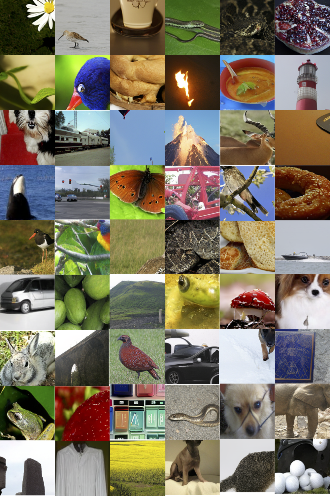

# MAGE PyTorch Implementation

<p align="center">
  
</p>

This is a PyTorch/GPU re-implementation of the paper 
<a href="https://arxiv.org/abs/2211.09117">MAGE: MAsked Generative Encoder to Unify Representation Learning and Image Synthesis</a>:

```
@article{li2022mage,
  title={MAGE: MAsked Generative Encoder to Unify Representation Learning and Image Synthesis},
  author={Li, Tianhong and Chang, Huiwen and Mishra, Shlok Kumar and Zhang, Han and Katabi, Dina and Krishnan, Dilip},
  journal={arXiv preprint arXiv:2211.09117},
  year={2022}
}
```

MAGE is a unified framework for both generative modeling and representation
learning, achieving SOTA results in both class-unconditional image generation
and linear probing on ImageNet-1K.
<p align="center">
  
</p>

A large portion of codes in this repo is based on <a href="https://github.com/facebookresearch/mae">MAE</a> and <a href="https://github.com/CompVis/taming-transformers">VQGAN</a>.
The original implementation was in JAX/TPU.

## Preparation

### Dataset
Download [ImageNet](http://image-net.org/download) dataset, and place it in your `IMAGENET_DIR`.

### Installation

A suitable [conda](https://conda.io/) environment named `mage` can be created and activated with:

```
conda env create -f environment.yaml
conda activate mage
```

Download the code
```
git clone https://github.com/LTH14/mage.git
cd mage
```
Use <a href="https://drive.google.com/file/d/13S_unB87n6KKuuMdyMnyExW0G1kplTbP/view?usp=sharing">this link</a>
to download the pre-trained VQGAN tokenzier and put it in the mage directory.

## Usage

### Pre-training

To pre-train a MAGE ViT-B model with 4096 batch size using 8 servers with 8 V100 GPUs per server:
```
python -m torch.distributed.launch --node_rank=0 --nproc_per_node=8 --nnodes=8 \
--master_addr="${MASTER_SERVER_ADDRESS}" --master_port=12344 \
main_pretrain.py \
--batch_size 64 \
--model mage_vit_base_patch16 \
--mask_ratio_min 0.5 --mask_ratio_max 1.0 \
--mask_ratio_mu 0.55 --mask_ratio_std 0.25 \
--epochs 1600 \
--warmup_epochs 40 \
--blr 1.5e-4 --weight_decay 0.05 \
--output_dir ${OUTPUT_DIR} \
--data_path ${IMAGENET_DIR} \
--dist_url tcp://${MASTER_SERVER_ADDRESS}:2214
```

The following table provides the performance and weights of the
pre-trained checkpoints used in the paper, converted from JAX/TPU
to PT/GPU:
<table><tbody>
<!-- START TABLE -->
<!-- TABLE HEADER -->
<th valign="bottom"></th>
<th valign="bottom">ViT-Base</th>
<th valign="bottom">ViT-Large</th>
<!-- TABLE BODY -->
<tr><td align="left">Checkpoint</td>
<td align="center"><a href="https://drive.google.com/file/d/1Q6tbt3vF0bSrv5sPrjpFu8ksG3vTsVX2/view?usp=sharing">Google Drive</a></td>
<td align="center"><a href="https://drive.google.com/file/d/15xBPa8EIa0IRUiRYtXiYOC9JZVyMIFrB/view?usp=sharing">Google Drive</a></td>
</tr>
</tr>
<tr><td align="left">Class-unconditional Generation FID </td>
<td align="center">11.1</td>
<td align="center">9.10</td>
</tr>
</tr>
<tr><td align="left">Class-unconditional Generation IS </td>
<td align="center">81.2</td>
<td align="center">105.1</td>
</tr>
<tr><td align="left">Linear Probing Top-1 Accuracy</td>
<td align="center">74.7%</td>
<td align="center">78.9%</td>
<tr><td align="left">Fine-tuning Top-1 Accuracy</td>
<td align="center">82.5% <a href="https://drive.google.com/file/d/1q-q-L9x7w9a5Q4aEfFrdRQUpjM-0kAsS/view?usp=sharing">Checkpoint</a></td>
<td align="center">83.9% <a href="https://drive.google.com/file/d/13w0LOnJ-MnyI2dBaGEkmdsf5xik2PUS6/view?usp=sharing">Checkpoint</a></td>
</tr>
</tbody></table>

### Linear Probing

To perform linear probing on pre-trained MAGE model using 4 servers with 8 V100 GPUs per server:
```
python -m torch.distributed.launch --node_rank=0 --nproc_per_node=8 --nnodes=4 \
--master_addr="${MASTER_SERVER_ADDRESS}" --master_port=12344 \
main_linprobe.py \ 
--batch_size 128 \
--model vit_base_patch16 \
--global_pool \
--finetune ${PRETRAIN_CHKPT} \
--epochs 90 \
--blr 0.1 \
--weight_decay 0.0 \
--output_dir ${OUTPUT_DIR} \
--data_path ${IMAGENET_DIR} \
--dist_eval --dist_url tcp://${MASTER_SERVER_ADDRESS}:6311
```

For ViT-L, set `--blr 0.05`.

### Fine-tuning

To perform fine-tuning with pre-trained ViT-B model using 4 servers with 8 V100 GPUs per server:

```
python -m torch.distributed.launch --node_rank=0  --nproc_per_node=8 --nnodes=4 \
--master_addr="${MASTER_SERVER_ADDRESS}" --master_port=12344 \
main_finetune.py \
--batch_size 32 \
--model vit_base_patch16 \
--global_pool \
--finetune ${PRETRAIN_CHKPT} \
--epochs 100 \
--blr 2.5e-4 --layer_decay 0.65 --interpolation bicubic \
--weight_decay 0.05 --drop_path 0.1 --reprob 0 --mixup 0.8 --cutmix 1.0 \
--output_dir ${OUTPUT_DIR} \
--data_path ${IMAGENET_DIR} \
--dist_eval --dist_url tcp://${MASTER_SERVER_ADDRESS}:6311
```

For ViT-L, set `--epochs 50 --layer_decay 0.75 --drop_path 0.2`.

### Class Unconditional Generation

To perform class unconditional generation with pre-trained MAGE model using a single V100 GPU:

```
python gen_img_uncond.py --temp 6.0 --num_iter 20 \
--ckpt ${PRETRAIN_CHKPT} --batch_size 32 --num_images 50000 \
--model mage_vit_base_patch16 --output_dir ${OUTPUT_DIR}
```

To quantitatively evaluate FID/IS, please first generate 256x256 
ImageNet validation images using

```
python prepare_imgnet_val.py --data_path ${IMAGENET_DIR} --output_dir ${OUTPUT_DIR}
```

Then install the <a href="https://github.com/toshas/torch-fidelity">torch-fidelity</a>
package by
```
pip install torch-fidelity
```

Then use the above package to evaluate FID/IS of the images generated 
by our models against 256x256 ImageNet validation images by 
```
fidelity --gpu 0 --isc --fid --input1 ${GENERATED_IMAGES_DIR} --input2 ${IMAGENET256X256_DIR}
```

Here are some examples of our class-unconditional generation:
<p align="center">
  
</p>

### MAGE-C
PyTorch training script coming soon. Here we provide the pre-trained MAGE-C 
checkpoints converted from JAX/TPU to PT/GPU: 
<a href="https://drive.google.com/file/d/1069p6ZURt-xLFYrHfUiySQt1VCmWsun3/view?usp=sharing">ViT-B</a>,
<a href="https://drive.google.com/file/d/1GOz8l6N-3LcUrM6a--TnBztN7NJpZ-Hp/view?usp=sharing">ViT-L</a>.

### Contact

If you have any questions, feel free to contact me through email (tianhong@mit.edu). Enjoy!